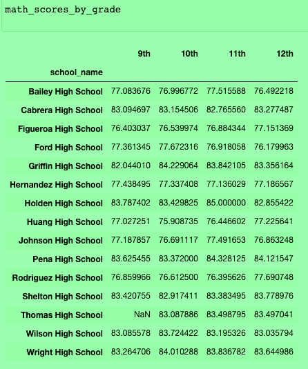
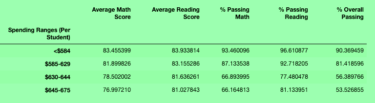
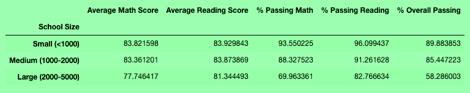
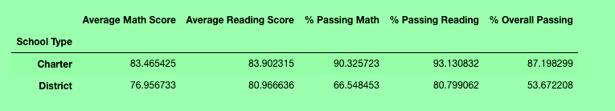

# School_District_Analysis
## Overview
The following analysis was conducted in order to further understand trends in student reading and math scores within the school district. Scores were broken down based on grade level, school, school size, school budget (amount spent per student), and school type (district or charter). In the Challenge file, the math and reading scores for one school's ninth grade students were removed from the dataset and the same analyses were run again for comparison. 

## Results
For the Challenge, Thomas High School's 9th grade reading and math scores were removed from the dataset. The DataFrames in the attached files include formated values that are easier to read (1 or 2 decimal places), In this case, some of the comparisons would not be visible in the formatted version so the original (longer-decimal) calculations are included below to illustrate the differences between the two analyses.
**Through the following comparison, the first image will demonstrate the original results with all schools, all grades scores.** 
*The second image reflects the impacted results once those 9th grade scores were removed for Thomas High School.* 

1.  On a district level, the average math score decreased by 0.1 in the modified analysis while the average reading score remained the same. The percentage of passing scores for math, reading, and overall passing each decreased by one percentage.

      
     

2.  Since the only scores impacted were for Thomas High School, this is the only school to have school summary results impacted. The removal of 9th grade scores results in Thomas High School's school summary include a 0.6 decrease in average math score, a 0.5 increase in average reading score, a 26 point decrease in math passing percentage, a 28 point decrease in reading passing percentage, and a 26 point decrease in overall passing percentage. 
 

3.  In the original analysis, Thomas High School ranked 2nd in the Top 5 performing schools based on overall passing percentage. Once the 9th grade scores were taken out of consideration, Thomas High School no longer ranks in the Top 5 performing schools. 
 

The impact was not significant enough to move Thomas High School to the bottom 5 performing schools. 
 

4. The modified analysis also impacted the district averages by grade for math and reading. For math, the overall average math score for 9th grade decreased by 0.24 points once the scores for Thomas High School were impacted. 
 

For reading scores, the average 9th grade score decreased by .09 without the scores from Thomas High School.
 

5. In terms of school spending (budget divided by number of students) to reflect amount spent per student, Thomas High School was grouped in with schools spending $630-$644 per student. For this group of schools, removing the 9th grade scores from Thomas High School also impacted this group of results. The average math score decreased by .02, the average reading score increased by .01, the percentage of passing math scores decreased by 6.6 percentages, the percentage of passing reading scores decreased by 6.9 percentages, and the overall passing score decreased by 6.5 percentages. 
 

6.  For school size, Thomas High School fell into the grouping of medium sized schools. This grouping analysis was also impacted by the removal of Thomas High School 9th grade scores. The average math score for medium sized schools decreased by .01, the average reading score increased by .01, the percentage of passing math scores decreased by 5.27 percentages, the percentage of passing reading scores decreased by 5.53 percentages, and the overall passing rate decreased by 5.17 percentages. 
 

 7. Lastly, for school type (charter vs. district), Thomas High School is categorized as a charter school. The analysis for charter schools was thus impacted by the the removal of Thomas High School's 9th grade scores. For this group, the average math score decreased by .01, the average reading score increased by .01, the percentage of passing math scores decreased by 3.3 percentages, the percentage of passing reading scores decreased by 3.46 percentages, and the overall passing rate decreased by 3.23 percentages.
  
 
 ## Summary
 - As the results above indicate, the impact of replacing the scores for 9th graders at Thomas High School with "NaN" had less than 1 point impact on average scores in all categories. The greater impact was reflected in the percentage of passing scores, particularly in the analysis at the school level (Item 2), school spending category (Item 5), and school size category (Item 6). 
 - Another interesting change is the impact on math versus reading scores. Math score averages consistently decreased while reading score averages typically increased in the modified analysis (with the exception of overall grade averages). The impact was consistently less than a full point. 
 - Overall, the impact on school categories (type, spending) did not significantly change how the categories compared to one another except in the case of school size (Item 6). In this case, the original analysis had medium sized schools performing similarly to small sized schools in the case of passing math rates and passing reading rates, and even higher in overall passing rate than small schools. In the modified analysis, medium sized schools now are several points below small sized schools in their passing rates. 
 - The modified analysis also resulted in Thomas High School falling out of the Top 5 Perforning schools. As it was ranked 2nd, this was a significant finding - however, the impact was not significant enough to drop the school to the list of 5 lowest performing schools.
 
